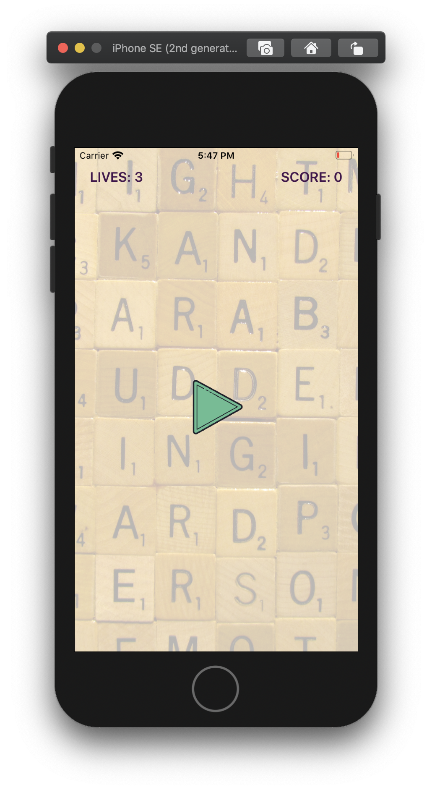
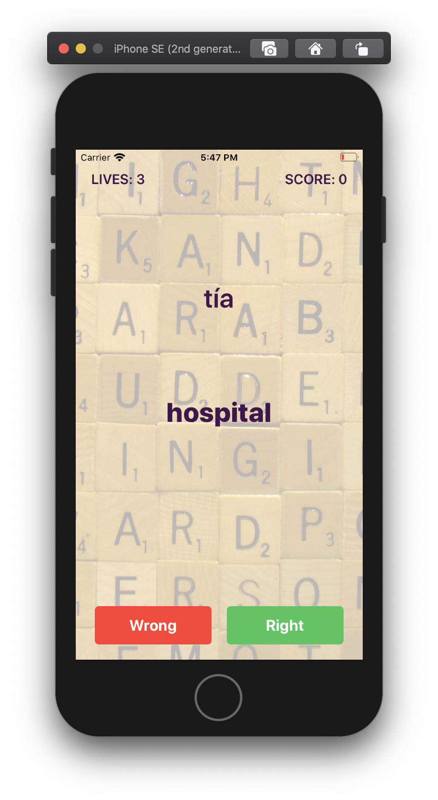
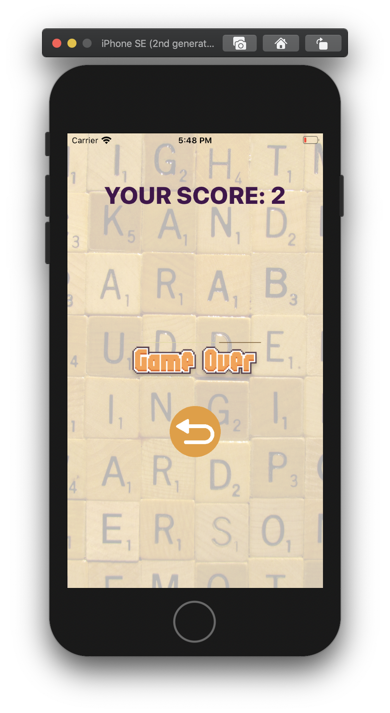

# The Falling Words.

## Author:- Ankur Arya
email: <ankur.arya@me.com>

## Overview
The Falling Words is a language game. When user clicks on the play button one can see a words (in English) on the screen.
Another word (in Spanish) will start falling down from top of the screen. User has to figure out if the translation is correct or not.
User can input ones response by pressing either of the botton at the bottom of the screen within 10 seconds otherwise 1 life will be deducted.
User will have 3 lives. After exhausting all 3 lives the game will be over.

## Architecture

This project follows MVVM along with other classes for Networking and Data Repository.
  - ViewModel: The main game logic is written in the view model. Also it provides data to the view for rendering. 
    caveat: As to keep the code simple the game logic is written in View Model. However, other option was to create a Game Manager which would have been responsible for the complete game play. This Game Manager ( abstract ) could be injected into the viewmodel. 
  - View (View Controller): This contains code for setting up the view and receiving user input.
  - Model: Simple data model objects.

## Get Started
  - Please open the project in Xcode 11.5 or above. It should work right out of the box.

## System Requirements
  - This sample app require minimum iOS 13 and Xcode 11.5 to run.

## Dependencies
  - RxSwift is added using Swift Package Manager.
  
## About Development 
 ### Total Time Spent: 6-7 Hours
 - Spent roughly 30-45 mins in analysing and thinking about how should I go about creating the game.
 - Spent roughly 2 hours setting up the basic game play and writing test cases.
 - Spent roughly 1.5 hours on the UI (mostly because I couldn't decide which icons and backgound image should I use.)
 - Spent rought 1 - 1.5 hour on Network Layer and Network Repo setup.
 - Spent roughly 1 hours on testing application and covering the edge cases (such as unavailibility of data, wrong format of data).
 - Spent roughly 30 mins on finishing touch.

 ### Decisions Made
 - Initially I was handling the time out scenario using CAAnimation delegate but for some reason the animationDidStop was getting called even after removing the animation layer from the label. To Fix this problem I used Timer.
 - For Game Over scenario I chose to go with number of lives remaining instead of the words in the data source. This is because it would have been extra work to figure out which words are already displayed to the user. A down side to this approach is user might see repeated words.

 ### Things To Improve
 - The UI/UX can definitely be improved.
 - The Game play logic should be in a Game Manager instead of View Model.

## Screenshots

